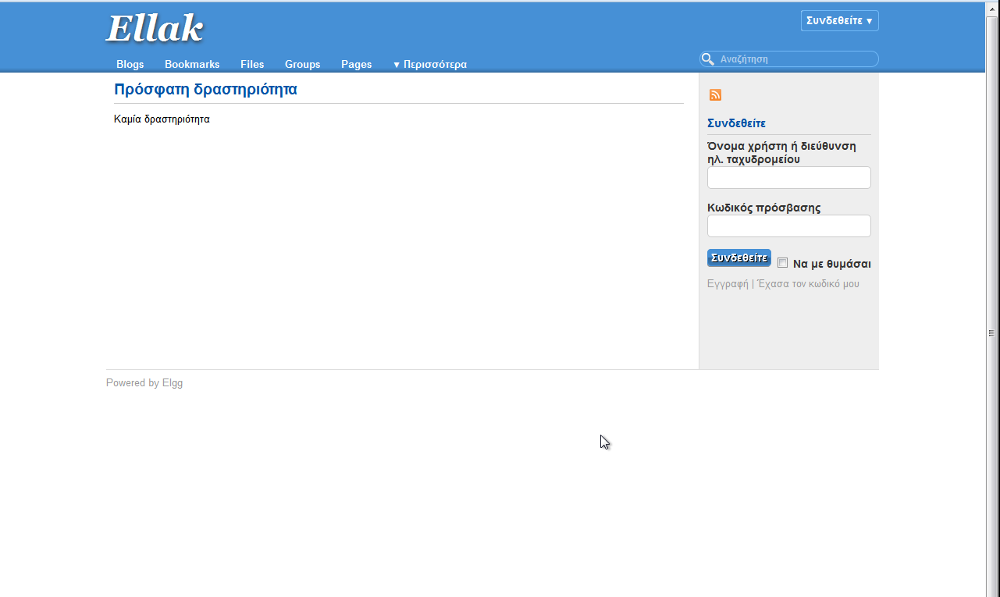
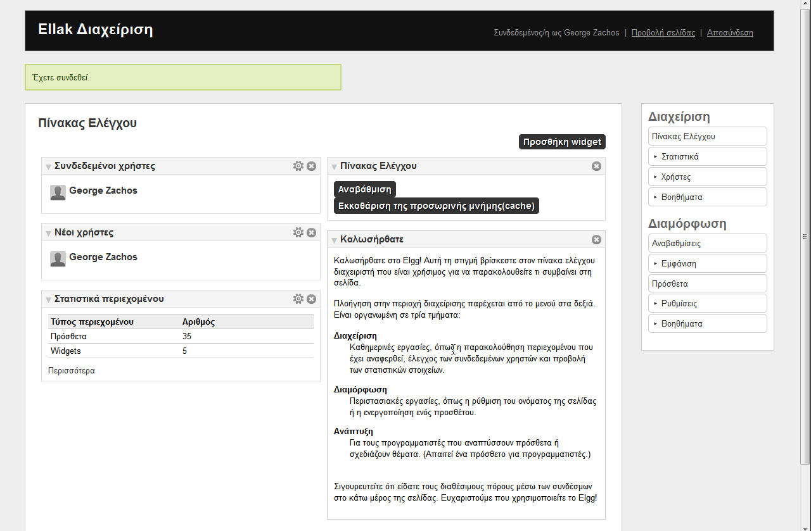
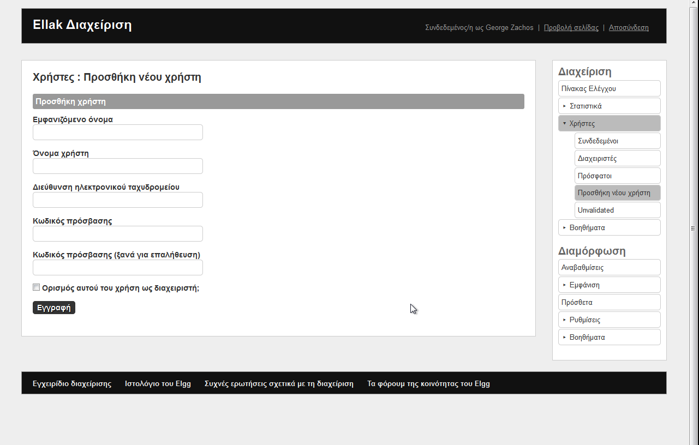
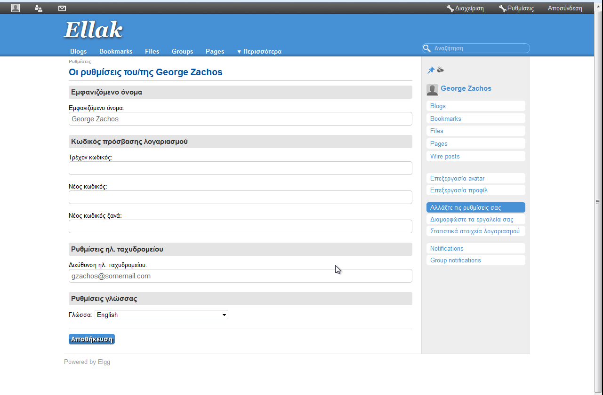
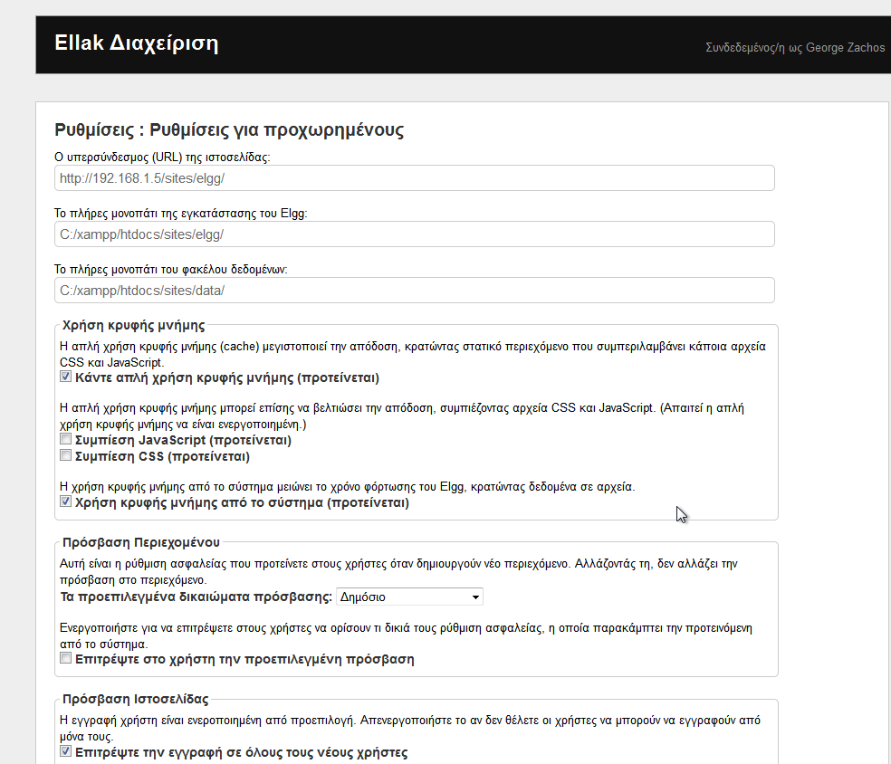

elgg_ellak
======

About this repository
-----

>This is a repository used for the localization of Elgg.

The Organization responsible
-----

>University of Ioannina Excellence Units -
>Greek Free and Open Source Software Society (GFOSS)

About Elgg
-----
>Elgg is an open source social networking software that provides individuals
>and organizations with the components needed to create an online social environment.
>It offers blogging, microblogging, file sharing, networking, groups and a number of
>other features. It was also the first platform to bring ideas from commercial social
>networking platforms to educational software.

Screenshots
-----------

 _Main Page_ 

 _Status Report_ 

 _Sample graph (1 Hour Log)_ 

 _Emerson Website Tree_ 

 _Measurement Report_ 

For more see inside the "screenshots" directory.

Translation type
-----
>From English to Greek

Comment Types
-----
When comments include:
 * __"#1"__ - _Untranslated word/phrase_ (High Priority issue)
 * __"#12"__ - _Untranslated word/phrase which has been already stated_ (zero-importance issue)
 * __"#2"__ -  _Interpretation issue_ (Middle Priority issue)
 * __"#8888"__ - _Error possibility during code execution_ (Both "Logic" and "Run Time" errors may occur)
 * __[ text ]__ - _An English string or part of a string unchanged_

Translation Progress by Sections
-----
 - [x] __Sites__
 - [x] __Sessions__
 - [x] __Errors__
 - [x] __User Deteils__
 - [x] __Access__
 - [x] __Dashboard and widgets__
 - [x] __Groups__
 - [x] __Users__
 - [x] __Friends__
 - [x] __Feeds__
 - [x] __Links__
 - [x] __River__
 - [x] __Notifications__
 - [x] __Search__
 - [x] __Account__
 - [x] __Administration__
 - [x] __Plugins__
 - [x] __User Settings__
 - [x] __Activity river__
 - [x] __Icons__
 - [x] __Generic action words__
 - [x] __Generic questions__
 - [x] __Status__
 - [x] __Generic sorts__
 - [x] __Generic data words__
 - [x] __Entity actions__
 - [x] __Input / output strings__
 - [x] __User add__
 - [x] __System messages__
 - [x] __Import / export__
 - [x] __Time__
 - [x] __System settings__
 - [x] __Welcome__
 - [x] __Emails__
 - [x] __user default access__
 - [x] __Comments__
 - [x] __Entities__
 - [x] __Action gatekeeper__
 - [ ] __Word blacklists__
 - [x] __Tag labels__
 - [ ] __Javascript__
 - [x] __Miscellaneous__
 - [x] __Languages according to ISO 639-1__

Translation Progress by Parts
-----
 - [x] P1: Sessions and Errors
 - [x] P2: User Details - Account
 - [X] P3: Administration
 - [X] P4: Plugins
 - [x] P5: User settings - Time
 - [x] P6: System settings
 - [x] P7: Welcome - Miscellaneous
 - [x] P8: Languages

Completed Sections
-----
(Ready for push to official ELGG repository)
 - [x] __Sites__
 - [x] __Sessions__
 - [x] __Errors__
 - [x] __User Details__
 - [x] __Access__
 - [x] __Dashboard and widgets__
 - [x] __Groups__
 - [x] __Users__
 - [x] __Friends__
 - [x] __Feeds__
 - [x] __Links__
 - [ ] __River__
 - [ ] __Notifications__
 - [ ] __Search__
 - [ ] __Account__
 - [ ] __Administration__
 - [ ] __Plugins__
 - [ ] __User Settings__
 - [ ] __Activity river__
 - [ ] __Icons__
 - [ ] __Generic action words__
 - [ ] __Generic questions__
 - [ ] __Status__
 - [ ] __Generic sorts__
 - [ ] __Generic data words__
 - [ ] __Entity actions__
 - [ ] __Input / output strings__
 - [ ] __User add__
 - [ ] __System messages__
 - [ ] __Import / export__
 - [ ] __Time__
 - [ ] __System settings__
 - [ ] __Welcome__
 - [ ] __Emails__
 - [ ] __user default access__
 - [ ] __Comments__
 - [ ] __Entities__
 - [ ] __Action gatekeeper__
 - [ ] __Word blacklists__
 - [ ] __Tag labels__
 - [ ] __Javascript__
 - [ ] __Miscellaneous__
 - [x] __Languages according to ISO 639-1__

Completes Parts
-----
(Ready for push to official ELGG repository)
 - [x] P1: Sessions and Errors
 - [ ] P2: User Details - Account
 - [ ] P3: Administration
 - [ ] P4: Plugins
 - [ ] P5: User settings - Time
 - [ ] P6: System settings
 - [ ] P7: Welcome - Miscellaneous
 - [x] P8: Languages
